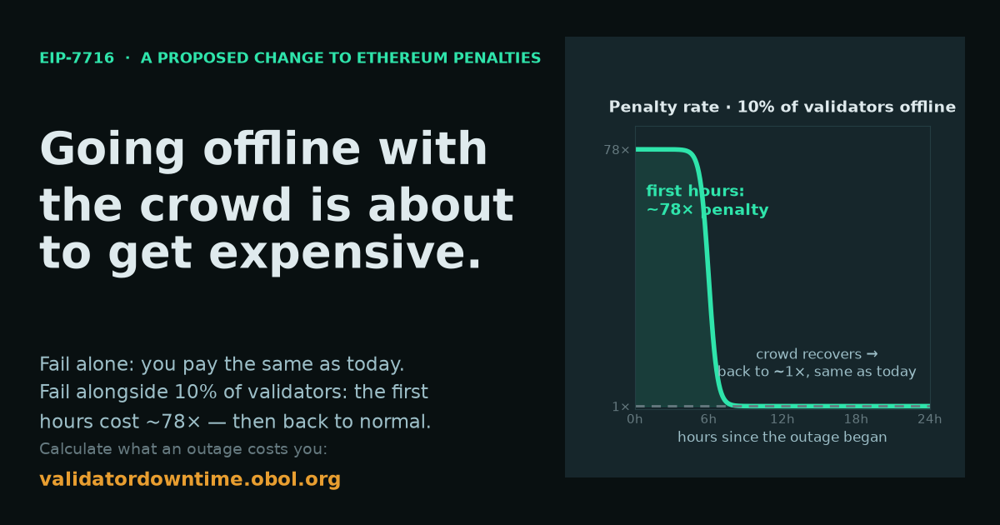

# EIP-7716 Validator Downtime Calculator

[](https://validatordowntime.obol.org)

Interactive tool for understanding what correlated downtime costs Ethereum validators under the **revised EIP-7716** anti-correlation penalties (2026 mechanism, [EIP-7716](https://eips.ethereum.org/EIPS/eip-7716), Draft status, [Proposed for Inclusion in Hegotá](https://forkcast.org/eips/7716)), and what that extra cost buys down.

**Live site**: [validatordowntime.obol.org](https://validatordowntime.obol.org)

## Overview

The revised EIP-7716 compares each slot's *offline balance* to a slow-moving average of itself and scales the timely-target penalty by the excess:

```
excess = max(0, offline − smoothed_offline_balance)
factor = min(1 + PENALTY_SLOPE × excess / committee_balance, MAX_PENALTY_FACTOR)
```

With:

- `MAX_PENALTY_FACTOR = 256`: the cap and single severity knob
- `PENALTY_SLOPE = 765 = 3 × (cap − 1)`: makes the cap bind at exactly ⅓ of stake offline
- `OFFLINE_BALANCE_SMOOTHING_FACTOR = 2^16`: moving-average half-life of about 6.3 days

Key properties the calculator demonstrates:

- **Uncorrelated failures pay exactly today's penalties.** The factor is never below 1× and there are no discount windows.
- **Severity scales with event size** at outage onset: 1% of stake → 9×, 10% → 78×, ⅓ or more → 256× (the cap).
- **The charge is front-loaded.** You pay for joining the correlation, not for how long the fix takes, so the multiple over today's rules *falls* as recovery stretches.
- **Only the "offline signature" is scaled**: validators missing *both* the timely-source and timely-target flags. A wrong target with a live source (relay outages, minority clients during majority-client bugs) pays today's unscaled rate.
- **Above ⅓ offline** the pre-existing inactivity leak activates and dominates multi-day totals. The site attributes that split honestly.

## Why: short-term pain, long-term gain

Correlated downtime and correlated safety failures share a cause: too much stake running the same software. The site puts the revised downtime penalty next to what the protocol already charges for correlated *safety* failures:

- **Correlated slashing**: balance × min(3 × share slashed, 1). A signing bug in a client with 25% of stake takes about 75% of each affected validator's principal. That's roughly 100× or more what the same cohort pays for a day of correlated downtime under EIP-7716.
- **Wrong-fork lockout**: once ⅔ or more of stake justifies an invalid chain, those validators can't return without surround votes. Leaking out costs about 72% to 96% of balance, depending on how much stake is trapped. Holesky's Pectra upgrade in February 2025 is the real-world example ([post-mortem](https://github.com/ethereum/pm/blob/master/Network-Upgrade-Archive/Pectra/holesky-postmortem.md)).
- **Client combinations**: the smallest sets of clients whose shared failure crosses ⅓ (finality lost) or ⅔ (lockout), computed from current client-share data.
- **Stop, don't steer**: why primary/fallback beacon nodes don't protect safety, and threshold setups that halt on disagreement do. This is tied to [Validator Beat](https://validatorbeat.com/methodology/)'s Stage 1 and Stage 2 levels.

## Features

- Event-size slider (0 to 45% of stake) with an onset-factor readout and the ⅓ finality threshold marked
- Independent cohort-outage and your-downtime durations, to model fast responders and stragglers
- Today vs revised cost in ETH and USD, payback expressed as days of full rewards, and the multiple over today
- Front-loaded cost curve (cost vs hours down) with marginal and "× today" views
- Area-true comparison of your downtime loss against the same cohort being slashed
- Real-event presets measured by historical replay (May 2023 finality incidents, Besu halt, Nethermind bug, Prysm post-Fusaka)
- EIP-vs-leak split for events above ⅓
- Client market-share quick-picks from [clientdiversity.org](https://clientdiversity.org)
- Shareable URLs: every input is kept in the query string

## The model (and its limits)

The site uses an approved simplification of the full mechanism. The moving average has a half-life of about 6.3 days, so within events of up to about 48h the factor is close to the onset factor while the cohort is offline, and close to 1 once the cohort has recovered. A validator's loss over an outage is:

```
loss = base_reward × 54/64 × epochs_down                      # forgone rewards
     + base_reward × 14/64 × epochs_down                      # source penalty, unscaled
     + base_reward × 26/64 × (factor × min(epochs_down, cohort_epochs)
                              + (epochs_down − min(...)))     # target penalty, scaled
     + inactivity_leak(epochs_down)                           # only if event > ⅓
```

This is within 5% of the exact model for events up to 48h. The integer-exact model, backtests over real mainnet outages, and all figures live in the [research repo](https://github.com/OisinKyne/7716). Unit tests (`npm test`) pin the calculator to the research repo's canonical anchor table.

The safety-failure figures (`src/lib/safetyModel.ts`) model pre-existing protocol rules that EIP-7716 doesn't change. The lockout figure is an epoch-by-epoch leak simulation that assumes the honest side stays online, so treat it as approximate.

## Development

**Tech stack**: React 18 + TypeScript + Gatsby 5, vitest for the calculation engine.

```bash
npm install
npm run develop    # dev server at localhost:8000
npm run build      # production build
npm run test       # calculation-engine test vectors
npm run typecheck  # TypeScript validation
npm run lint       # ESLint
```

## Deployment

Pushes to `main` deploy automatically to GitHub Pages via GitHub Actions.

## Resources

- [EIP-7716 specification (constants, FAQ, rationale)](https://eips.ethereum.org/EIPS/eip-7716)
- [EIP-7716 on Forkcast (Hegotá inclusion status)](https://forkcast.org/eips/7716)
- [Research repo: replays, severity/window tuning, figures](https://github.com/OisinKyne/7716)
- [ethresear.ch analysis write-up](https://ethresear.ch/t/supporting-decentralized-staking-through-more-anti-correlation-incentives/19116/18)
- [consensus-specs feature PR](https://github.com/ethereum/consensus-specs/pull/5452)
- [Holesky Pectra incident post-mortem](https://github.com/ethereum/pm/blob/master/Network-Upgrade-Archive/Pectra/holesky-postmortem.md)

## License

Licensed under the [Apache License, Version 2.0](LICENSE).
